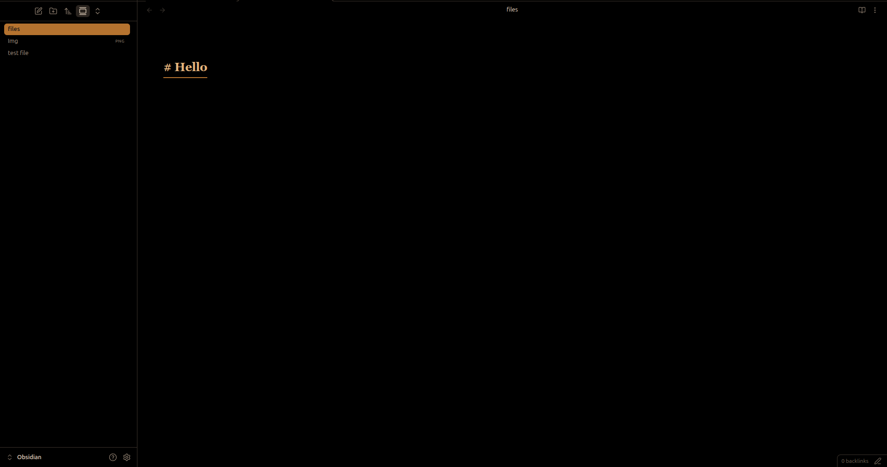

# Cozy Journal

A warm, dark journaling theme for Obsidian. Pure black background, warm amber accents, serif reading font, and Notion-style gradient banners — no plugins required.

> **Version:** 1.0.6 · **Author:** [OmShirse](https://github.com/OmShirse) · **License:** MIT

---

## ✨ Features

- **Pure black** (`#000000`) background — easy on the eyes
- **Warm amber/brown** accent palette (`#b5732f` → `#e0a458`)
- **Serif font** (Georgia / Iowan Old Style) for cozy long-form journaling
- **JetBrains Mono / Fira Code** for code blocks
- **Tiered heading colors** — H1–H6 each have a distinct warm amber shade
- **Redesigned sidebar** — rounded file/folder tiles with hover highlights
- **Redesigned tabs** — rounded corners, amber active state
- **Styled status bar** — minimal, muted
- **Rounded blockquotes** — italic, amber left border
- **Rounded code blocks** — dark background with border
- **Amber pill tags** — bold and compact
- **Custom scrollbars** — slim, rounded, amber on hover
- **Justified text** — in both Reading View and Live Preview
- **Custom list bullets** — `◈` diamond icon in accent color
- **Hover image zoom** — images scale up smoothly on hover with rounded borders
- **Hidden frontmatter box** — properties panel hidden by default for a cleaner look
- **Notion-style banners** — colored gradient header per note, no plugin needed
- **Respects "Readable line length"** — max 720px centered; full-width when disabled
- **Canvas node defaults** — 360×260px default canvas node size

---

## 🚀 Installation

1. Download `manifest.json` and `theme.css`
2. In your vault, create the folder: `.obsidian/themes/Cozy Journal/`
3. Place both files inside
4. In Obsidian: **Settings → Appearance → Themes → select Cozy Journal**

---

## 🎨 Banners

Add a colored gradient banner to any note — no plugin required:

```yaml
---
cssclasses: banner-1
---
```

| Class | Color |
|---|---|
| `banner-1` | Warm amber |
| `banner-2` | Green |
| `banner-3` | Purple |
| `banner-4` | Red |

---

## 🛠 Customization

Edit CSS variables at the top of `theme.css` to tweak the look:

| Variable | Default | Purpose |
|---|---|---|
| `--background-primary` | `#000000` | Main background |
| `--interactive-accent` | `#b5732f` | Accent color (tabs, tags, borders) |
| `--text-accent` | `#e0a458` | Link & bullet color |
| `--font-text` | Georgia, serif | Body font |
| `--font-monospace` | JetBrains Mono | Code font |
| `--file-line-width` | `720px` | Max readable line width |

---

## 📄 License

MIT
